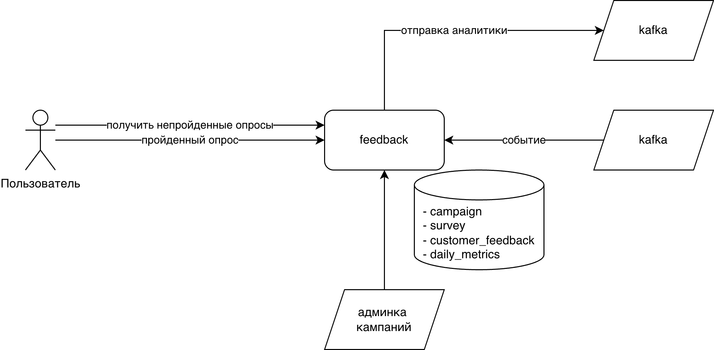

# Feedback

Название микросервиса: feedback

Микросервис для сбора и анализа стандартизированных метрик удовлетворённости клиентов (NPS, CSAT, CES) с автоматическими триггерами и real-time аналитикой.

## Алгоритм работы



1. Создание опроса пользователя:
    - приходит событие из топика `customer-events` 
    - если тип события подпадает под одну из активных кампаний опроса, то создаётся опрос (survey) со статусом PENDING
2. Получение непройденных опросов клиентом:
    - клиент открывает приложение и отправляет запрос GET `/api/v1/feedback/surveys?guid=...`
    - возвращаются опросы в статусе PENDING, у которых наступило время отправки (`scheduled_at` < NOW())
    - при первом получении опроса заполняется поле `sent_at`
3. Отправка ответа от клиента:
    - клиент отправляет результат опроса через POST `/api/v1/feedback/submit`
    - результат сохраняется в таблицу `customer_feedback`
    - статус опроса меняется на COMPLETED
4. Job агрегации метрик (AggregateMetrics):
    - ежедневно в 00:05 собирает метрики за предыдущий день
    - сохраняет агрегированные данные в таблицу `daily_metrics`
    - отправляет события в топик `daily-metrics`
5. Job истечения опросов (ExpireOldSurveys):
    - раз в сутки помечает просроченные опросы статусом EXPIRED

Дополнительно:

1. Администратор может управлять кампаниями через CRUD API `/api/v1/campaigns`


---

## 1. Модель данных

### survey_type (Тип опроса — справочник)
```
{
  code: varchar (PK),            // NPS, CSAT, CES
  name: string,                  // Полное название типа
  question: string,              // Текст вопроса для клиента
  scale_min: int,                // Минимальное значение шкалы
  scale_max: int,                // Максимальное значение шкалы
  formula_description: string,   // Описание формулы расчёта (для документации)
  create_time: timestamp,
  create_user: varchar,
  last_update_time: timestamp,
  last_update_user: varchar
}
```

### campaign (Кампания опроса)
```
{
  id: UUID,
  name: string,
  survey_type_code: varchar,
  trigger_type: varchar(ORDER_COMPLETED, TICKET_CLOSED),
  delay_hours: int,           // 0 = сразу, 24 = через сутки
  active: boolean,
  start_date: timestamp,
  end_date: timestamp | null,
  deleted: boolean,
  create_time: timestamp,
  create_user: varchar,
  last_update_time: timestamp,
  last_update_user: varchar
}
```

### survey (Запрос на прохождение опроса клиентом)
```
{
  id: UUID,
  campaign_id: UUID,
  guid: string,
  context_type: enum(ORDER, TICKET),
  context_id: string,
  status: enum(PENDING, COMPLETED, EXPIRED),
  scheduled_at: timestamp,
  sent_at: timestamp | null,
  completed_at: timestamp | null,
  create_time: timestamp,
  create_user: varchar,
  last_update_time: timestamp,
  last_update_user: varchar
}
```

- scheduled_at заполняется как `create_time` + `delay_hours`

### customer_feedback (Ответ клиента на опрос)
```
{
  id: UUID,
  survey_id: UUID,
  guid: string,
  score: int,
  comment: string | null,
  create_time: timestamp,
  create_user: varchar,
  last_update_time: timestamp,
  last_update_user: varchar
}
```

### daily_metrics (Агрегированные ежедневные метрики)
```
{
  id: UUID,
  campaign_id: UUID,
  date: date,
  survey_type_code: varchar (FK → survey_type.code),
  total_responses: int,
  score_value: decimal,       // NPS: -100..100, CSAT: 0..100, CES: 1..5
  promoters: int | null,      // только для NPS
  passives: int | null,
  detractors: int | null,
  create_time: timestamp,
  create_user: varchar,
  last_update_time: timestamp,
  last_update_user: varchar
}
```

---

## 2. API Endpoints

### Campaigns CRUD

```
POST   /api/v1/campaigns           - создать кампанию
POST   /api/v1/campaigns/filter    - поиск кампаний (с возможностью фильтрации по: namePart, type, trigger_type, active, start_date_from, start_date_to, end_date_from, end_date_to)
GET    /api/v1/campaigns/{id}      - получить кампанию
PUT    /api/v1/campaigns/{id}      - обновить кампанию
DELETE /api/v1/campaigns/{id}      - удалить кампанию (soft delete)
```

### Сохранение отзыва клиента

```
POST /api/v1/feedback/submit
```
**Request:**
```json
{
  "survey_id": "uuid",
  "score": 9,
  "comment": "Отличный сервис!"
}
```

**Валидации:**
1. `survey_id` существует и в статусе PENDING
2. `score` в допустимом диапазоне для типа опроса

**Response (200):**
```json
{
  "success": true,
  "feedback_id": "uuid",
  "message": "Спасибо за ваш отзыв!"
}
```

### Получение непройденных опросов клиентом

```
GET /api/v1/feedback/surveys
```
**Query Parameters:**
- `guid` (required) - идентификатор клиента

**Response (200):**
```json
{
  "surveys": [
    {
      "survey_id": "uuid",
      "campaign_id": "uuid",
      "survey_type": "NPS",
      "question": "Оцените от 0 до 10, порекомендуете ли вы нас?",
      "scale_min": 0,
      "scale_max": 10,
      "context": {
        "type": "ORDER",
        "context_id": "order_456",
        "timestamp": "2024-01-15"
      },
      "sent_at": "2024-01-15T14:30:00Z"
    }
  ]
}
```

**Описание:**
- Возвращает непройденных опросов (статус PENDING) для клиента, если NOW() > `scheduled_at`
- Опросы отсортированы по дате отправки (новые в начале)
- Включает информацию о контексте (заказ, тикет) для отображения в клиентском приложении
- При возврате опросов клиенту, у которых `sent_at` равен null, поле `sent_at` заполняется текущим временем (NOW()) (Это происходит только при первом запросе опросов — повторные запросы не изменяют `sent_at`)

### Получение метрик

```
POST /api/v1/metrics/filter
```
**Request:**
```json
{
  "campaignId": "uuid",
  "type": "NPS",
  "dateFrom": "2024-01-01",
  "dateTo": "2024-01-31"
}
```

**Response (200):**
```json
{
  "metrics": [
    {
      "campaignId": "uuid",
      "campaignName": "NPS после заказа",
      "date": "2024-01-15",
      "type": "NPS",
      "totalResponses": 150,
      "scoreValue": 45.5,
      "promoters": 100,
      "passives": 30,
      "detractors": 20
    }
  ],
  "summary": {
    "totalResponses": 4500,
    "averageScore": 42.3,
    "periodFrom": "2024-01-01",
    "periodTo": "2024-01-31"
  }
}
```

**Описание:**
- Возвращает агрегированные ежедневные метрики с возможностью фильтрации
- Поля `promoters`, `passives`, `detractors` заполнены только для типа NPS
- `summary` содержит агрегированные данные за весь запрошенный период
- Результаты отсортированы по дате (новые в начале)

---

## 3. Kafka Events

### Входящие события (Consumer)

**Topic:** `customer-events`

```json
{
  "event_type": "ORDER_COMPLETED",
  "guid": "cust_123",
  "context_id": "order_456",
  "context_type": "ORDER",
  "timestamp": "2024-01-15T14:30:00Z",
  "metadata": {
    "order_total": 5000,
    "items_count": 3
  }
}
```

```json
{
  "event_type": "TICKET_CLOSED",
  "guid": "cust_123", 
  "context_id": "ticket_789",
  "context_type": "TICKET",
  "timestamp": "2024-01-15T15:00:00Z",
  "metadata": {
    "resolution_time_hours": 2,
    "category": "refund"
  }
}
```

**Логика обработки:**
1. Найти активные кампании с matching `trigger_type`
2. Проверить, что для данного `context_id` + `campaign_id` ещё не существует survey (дедупликация)
3. Создать `Survey` со статусом PENDING
4. Неиспользуемые поля игнорируются (например `metadata`)

### Исходящие события (Producer)

**Topic:** `daily-metrics`

Отправляется Job'ом `AggregateMetrics` ежедневно для каждой кампании с данными за предыдущий день.

```json
{
  "event_type": "DAILY_METRICS_AGGREGATED",
  "campaign_id": "uuid",
  "campaign_name": "NPS после заказа",
  "date": "2024-01-15",
  "type": "NPS",
  "total_responses": 150,
  "score_value": 45.5,
  "promoters": 100,
  "passives": 30,
  "detractors": 20,
  "timestamp": "2024-01-16T00:05:00Z"
}
```

---

## 4. Scheduled Jobs

### ExpireOldSurveys  
**Расписание:** раз в сутки

**Логика:**
1. `UPDATE survey SET status = EXPIRED WHERE status = PENDING AND sent_at < NOW() - INTERVAL '7 days'`
   значение интервала берется из настройки `survey-expiry-days`

### AggregateMetrics
**Расписание:** ежедневно в 00:05

**Логика:**
1. Для каждой кампании посчитать метрики за прошедший день

---

## Логика наполнения daily_metrics

Таблица `daily_metrics` агрегирует ответы клиентов (`customer_feedback`) по дням для каждой кампании.

### Когда создаются записи
- **Scheduler AggregateMetrics** — ежедневно в 00:05 обрабатывает все ответы за предыдущий день
- Для каждой пары `(campaign_id, date)` создаётся одна запись в `daily_metrics`

### Алгоритм расчёта

**Шаг 1.** Выбрать все `customer_feedback` за целевую дату (по `create_time`), сгруппировать по `campaign_id`

**Шаг 2.** Для каждой группы рассчитать метрики в зависимости от типа кампании:

| Тип | Расчёт `score_value` | Дополнительные поля |
|-----|---------------------|---------------------|
| **NPS** | `(promoters - detractors) / total * 100` | `promoters` (score 9-10), `passives` (score 7-8), `detractors` (score 0-6) |
| **CSAT** | `satisfied (score 4-5) / total * 100` | — |
| **CES** | `SUM(score) / total` (среднее) | — |

**Шаг 3.** Сохранить или обновить запись в `daily_metrics`:
```
{
  campaign_id: UUID,
  date: целевая_дата,
  type: тип_кампании,
  total_responses: количество_ответов,
  score_value: рассчитанное_значение,
  promoters: количество (только NPS),
  passives: количество (только NPS),
  detractors: количество (только NPS)
}
```

---

## 5. Конфигурация

```yaml
# application.yml
feedback:
  survey-expiry-days: 7

kafka:
  consumer:
    group-id: feedback
    customer-events:
      topic: customer-events.V1
  producer:
    daily-metrics:
      topic: daily-metrics.V1
```

---

## 6. Начальные данные (Seed Data)

### Таблица survey_type

| code | name | question | scale_min | scale_max | formula_description |
|------|------|----------|-----------|-----------|---------------------|
| NPS | Net Promoter Score | Оцените от 0 до 10, порекомендуете ли вы нас? | 0 | 10 | (promoters - detractors) / total * 100 |
| CSAT | Customer Satisfaction Score | Оцените качество обслуживания | 1 | 5 | satisfied (4-5) / total * 100 |
| CES | Customer Effort Score | Насколько легко было решить вопрос? | 1 | 5 | SUM(score) / total |

### Таблица campaign (тестовые данные)

| name | survey_type_code | trigger_type | delay_hours | active | start_date |
|------|------------------|--------------|-------------|--------|------------|
| NPS после заказа | NPS | ORDER_COMPLETED | 24 | true | 2024-01-01 |
| CSAT после обращения в поддержку | CSAT | TICKET_CLOSED | 0 | true | 2024-01-01 |

